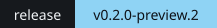
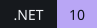
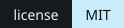

<h1 align="center">YMM4 NVENC・描画キャッシュ</h1>

<p align="center">
ゆっくりMovieMaker4 の動画出力を NVIDIA NVENC で。<br>
プレビューと動画出力で描き終えたフレームを RAM・ディスク・GPU に取っておき、同じフレームは描き直さずに出します。
</p>

<p align="center">
  <a href="https://github.com/sabiasagimp4-ai/YMM4-RTX3060-NVENC/releases"></a>
  
  <a href="LICENSE"></a>
</p>

> [!CAUTION]
> **開発中のプレビュー版です。** 入れる前に作業中のプロジェクトを保存してください。配布しているのは、このリポジトリの [Releases](https://github.com/sabiasagimp4-ai/YMM4-RTX3060-NVENC/releases) だけです。

> [!IMPORTANT]
> 描画キャッシュは、新しく入れたときは **OFF** です。ツール「描画キャッシュ」で ON にしてください。NVENC 出力には NVIDIA の GPU が必要です。

## 目次

- [できること](#できること)
- [はじめる](#はじめる)
- [動作環境](#動作環境)
- [対応状況](#対応状況)
- [設定](#設定)
- [NVENC 出力の詳細](#nvenc-出力の詳細)
- [自分でビルドする](#自分でビルドする)
- [開発・検証資料](#開発検証資料)

## できること

| 機能 | 内容 |
| --- | --- |
| **NVENC 出力** | H.264・HEVC・AV1（AV1 は RTX 40 シリーズ以降）。YMM4 が描いた GPU のフレームを、CPU を通さずにエンコーダーへ渡します |
| **描画キャッシュ** | 標準プレビューと動画出力で、描き終えたフレームを保存して使い回します。ツールの帯は緑が RAM、青がディスク |
| **停止中の先読み** | 手を止めて 8 秒たつと、まだ描いていないフレームを裏で描いておきます |
| **編集に強い** | キーはフレームごと。編集したアイテムの区間だけが描き直しになり、Undo で戻すと保存済みのフレームが戻ります |
| **YMM4 と同じ絵** | 完成を確かめられないフレーム（読み込み途中の動画など）は保存しません。確かめられないものが映る区間は、YMM4 がそのまま描きます |

## はじめる

1. YMM4 を終了します。
2. [Releases](https://github.com/sabiasagimp4-ai/YMM4-RTX3060-NVENC/releases) から `YMM4-RTX3060-NVENC.ymme` をダウンロードして開き、YMM4 へインストールします（SHA-256 のファイルも添付しています）。
3. YMM4 を起動し、ツール「描画キャッシュ」でキャッシュを ON にします。短い区間で表示・映像・音声・同期を確かめてから使ってください。

## 動作環境

| 項目 | 条件 |
| --- | --- |
| YMM4 | **Lite 4.47.0.0 以降**（.NET 10 で動く版。v0.2.0-preview.3 までは 4.56.1.0 以降でした）。4.56.1.0 はコードを読んで全機能を確かめた版で、4.47.0.0〜4.56.0.1 は 4.56.1.0 との違いを読んで、描画キャッシュで使える機能を版ごとに確かめました（立ち絵は 4.56.1.0 だけです）。描画キャッシュは、プラグインが起動時に YMM4 のコードを照合して、確かめたコードと同じ部分だけを使います。NVENC 出力はどの版でも使えます。4.46 以前（.NET 8・9）では読み込めません。版ごとの結果は下の表を参照してください |
| 描画キャッシュ | GPU の種類を問いません（内蔵 GPU でも使えます） |
| NVENC 出力 | NVENC を積んだ NVIDIA GPU と、ドライバー R570 以降（NVENC API 13.0） |

### YMM4 の版ごとの対応

<!-- ymm4-versions:begin -->
YMM4 の更新サーバーで公開されている版（とコードを読んだ版）の計 189 版を、プラグイン 0.2.0-preview.4 の後の開発版 854e228 で自動で確かめた結果です（2026-10-06 更新）。新しい版が公開されると自動で確かめて、ここに追加します。同じ結果が続く版はまとめています。版ごとの結果と確かめ方は [YMM4 の版ごとの対応](docs/YMM4_VERSIONS.md) を参照してください。

**○** 使える　**△** 一部だけ使える　**×** 使えない　**？** 未確認

| YMM4 | 読み込み | NVENC 出力 | 描画キャッシュ | 備考 |
| --- | :---: | :---: | :---: | --- |
| 4.56.1.0 | ○ | ○ | ○ | コードを読んだ版 |
| 4.56.0.0 〜 4.56.0.1（2 版） | ○ | ○ | △ | キャッシュで使わない機能: シンプル立ち絵、口パクの完成判定、動く立ち絵、PSD 立ち絵。コードを読んだ版（4.56.1.0 と同じ部分も使用） |
| 4.55.0.0 〜 4.55.1.1（4 版） | ○ | ○ | △ | キャッシュで使わない機能: シンプル立ち絵、口パクの完成判定、動く立ち絵、PSD 立ち絵。コードを読んだ版 |
| 4.47.0.0 〜 4.54.0.1（48 版） | ○ | ○ | △ | キャッシュで使わない機能: 選択枠、シンプル立ち絵、口パクの完成判定、動く立ち絵、PSD 立ち絵。コードを読んだ版 |
| 4.35.0.0 〜 4.46.1.7（84 版） | × | — | — | YMM4 が .NET 9 で動くため、.NET 10 向けのプラグインを読み込めません |
| 4.23.0.0 〜 4.34.2.0（50 版） | × | — | — | YMM4 が .NET 8 で動くため、.NET 10 向けのプラグインを読み込めません |
<!-- ymm4-versions:end -->

### NVENC の対応コーデック

| GPU | H.264 | H.265（HEVC） | AV1 |
| --- | --- | --- | --- |
| GeForce RTX 20／30 シリーズ、GTX 16 シリーズなど | ○ | ○ | × |
| GeForce RTX 40／50 シリーズ | ○ | ○ | ○ |

- GPU の種類による決め打ちはありません。出力のたびに、その GPU の NVENC が対応するコーデックと最大解像度を問い合わせます。対応しない組み合わせや古いドライバーでは、理由と対処を日本語で表示します。
- NVENC は、YMM4 が描画に使う GPU と同じ GPU で動きます。内蔵 GPU で描画しているノート PC では、Windows のグラフィックス設定で YukkuriMovieMaker を「高パフォーマンス」にしてください。
- 実機で確認したのは RTX 3060（H.264／HEVC）だけです。AV1 と他の GPU は未確認です。

## 対応状況

描画キャッシュが保存・再利用できるもの（キャッシュするのは映像のフレームです）。

**○** 対象　**△** 条件付きで対象　**×** 対象外（そのアイテムが映る区間だけ YMM4 がそのまま描き、ほかの区間は対象のまま）

### 素材・アイテム

| 種類 | 対応 | 条件・備考 |
| --- | :---: | --- |
| 画像（PNG・JPEG・GIF・WebP など）、PSD 画像、SVG | ○ | ファイルの中身の指紋をキーにします |
| 動画（Media Foundation・FFmpeg で読むもの） | ○ | 要求した時刻までデコードできたことを確かめてから保存します |
| 連番画像 | ○ | 各フレームは、そのとき表示する 1 枚だけに依存します |
| テキスト・字幕・ボイスの字幕 | ○ | 文字装飾・制御タグ・「*」置換・代替フォントを含みます |
| 図形、YMM4 標準のエフェクト・トランジション | ○ | |
| ランダム移動などのランダム系、文字を「ランダム」の順で表示するテキスト・字幕 | △ | YMM4 がオブジェクトごとに乱数を決めるため、その起動の間だけ使います。YMM4 が描画器ごとに乱数を変える部分（テキスト・字幕のランダム順、4.52.0.1 以前のランダム系エフェクト）は、プラグインが描くアイテムを種にそろえます（プレビュー・出力・先読みが同じ乱数になり、ランダム順の文字は画面に入り直しても同じ順になります） |
| シーンアイテム、音声波形 | △ | プロジェクト全体に依存します（どこを編集しても、その区間は描き直し） |
| 同じレイヤーで時間が重なるアイテム | × | YMM4 はアイテム一覧の順で重ねますが、その順をキーに入れていません |
| 動画（DirectShow で読むもの） | × | 読み込みの完了を確かめる方法がまだありません |
| インターネット上の素材、クラウドの「オンラインのみ」のファイル | × | 読むたびに中身が変わり得る、または読むとダウンロードが始まります |

### 立ち絵（YMM4 4.56.1.0 同梱版）

口パクは、YMM4 が音量を計算し終えたことを確かめてから保存します。時間切れで口が閉じたまま描かれたフレームは保存しません。

| 種類 | 対応 | 条件・備考 |
| --- | :---: | --- |
| シンプル立ち絵 | ○ | 停止中の先読みでも描きます |
| 動く立ち絵 | △ | PNG の部品だけ。まばたきが起動ごとに変わるため、その起動の間だけ使います。停止中の先読みでは描かず、再生したときに保存します |
| PSD 立ち絵 | △ | 動く立ち絵と同じく、その起動の間だけ使い、再生したときに保存します |
| 上記以外の立ち絵、グループ・入れ子の中、表情が同じレイヤーで重なるものなど | × | 完成を確かめる方法をまだ用意していません（[調査](docs/LIPSYNC_RESEARCH_2026-10-04.md)） |

### プラグイン

| 種類 | 対応 | 条件・備考 |
| --- | :---: | --- |
| 同梱の Community プラグイン（コードを読んで確かめた約 70 種） | ○ | PDF ページ、レンズフレア、ブルームなど。一覧は [KnownCode.cs](NVEncVideoWriterPlugin/KnownCode.cs) |
| Community の残像・モーションブラー・CircularBlur | × | 直前に描いたフレームによって絵が変わります |
| Community の LUT・グラデーションマップ・グループ制御・Container など | × | 読むファイルを YMM4 に報告しない（LUT など）、ほかのアイテムやシーンを描く（グループ制御など）、まだコードを読んでいない、のいずれか |
| 外部プラグイン | △ | 設定で個別に「信頼」したものだけ。プラグインを更新するとキーが変わります |
| OpenFX・VST3 | × | 外部のネイティブのプログラムで、中身を確かめられません |

理由と今後の予定は [自動対象の範囲](docs/AUTOMATIC_COVERAGE_2026-10-03.md)、外部プラグインを自動で判定する案は [外部プラグインの判定](docs/EXTERNAL_PLUGINS_2026-10-04.md)、保存条件・上限・乱数の扱いは [キャッシュ仕様](docs/CACHE_BEHAVIOR.md) を参照してください。

## 設定

ツール「描画キャッシュ」と「その他 > NVENC・描画キャッシュ」で同じ設定を変更できます。

| 設定 | 対象 | 新規インストール時 |
| --- | --- | --- |
| プレビューで描画キャッシュを使う | 標準プレビュー、停止中の先読み、キャッシュバー | OFF |
| 動画出力で描画キャッシュを使う | YMM4 標準形式と NVENC の描画 | OFF |
| NVIDIA NVENC 出力を使う | 出力形式「NVIDIA NVENC 出力」 | ON |

### 停止中の先読み

ツール「描画キャッシュ」を開いている間、操作から既定 8 秒後にタイムライン全体を巡回します。待ち時間、範囲、順番、同時に描く描画器の数（Auto・1・2・4 本。Auto はコア数と VRAM から決めます）を変えられます。

### メモリ

| メモリ | 自動配分（既定） | 上限の既定 |
| --- | --- | --- |
| RAM | 空き物理メモリに応じて調整 | 2048 MiB |
| VRAM（GPU 保持） | 描画に使う GPU の VRAM の予算と使用量に応じて調整 | Auto（最大 8192 MiB） |
| ディスク | 容量を超えると、使ったのが古いものから消す | 4 GiB（固定） |

GPU 保持では、表示したフレームを GPU 上に残し、RAM からの再転送を省きます。

- VRAM の自動配分は、搭載 VRAM の 1/2 まで（最大 8 GiB）、かつ上限までです。YMM4 自身と他のアプリの分を残します。専用の VRAM がない内蔵 GPU では GPU 保持を使いません（RAM からの表示は使えます）。
- 前の版の既定（自動・2048 MiB）のままの設定は、一度だけ Auto に移します。
- 他のアプリが VRAM を使って逼迫すると、すぐに減らします。
- 手動にすると、上限の値で固定します。「使わない」も選べます。

詳細ログはツールから開始／停止できます（既定 OFF）。

## NVENC 出力の詳細

- 解像度・fps に応じた可変ビットレートが既定です。幅・高さは偶数が必要です。出力設定（コーデック・ビットレート方式・品質など）はプラグインの設定に保存され、次回の起動でも使います。
- GPU のフレームを所有 D3D11 テクスチャへコピーし、CPU readback を介さず NVENC へ渡します。キャッシュ保存の readback とは別の経路です。非同期エンコードに対応しない GPU では同期処理に切り替えます。
- 入力・出力キューに上限を設け、NVENC 呼出しは専用 MTA スレッドで実行します。先行音声は一時ファイルへ退避し、AAC は 44.1／48 kHz のモノラル／ステレオに対応します。MP4 のサンプル索引は出力時間に比例して RAM を使います。
- 取消・失敗・予定フレーム不足では既存の完成ファイルを置き換えず、途中の `.partial` を削除します。デバッグ有効時の `.partial.nvenc_log.txt` は出力先に残ります。OS やドライバー内部の停止を強制解除する仕組みではありません。

## 自分でビルドする

Windows、.NET 10 SDK、Visual Studio 2022 の C++ ツール、Windows SDK が必要です。使用する YMM4 のフォルダーを明示してビルドします。新しい YMM4 の DLL でビルドしたプラグインを古い YMM4 へ入れると、参照アセンブリを読み込めない場合があります。ビルド時に対象ホストでの型ロードも検査します。

```powershell
.\build.ps1 -Ymm4DirPath 'D:\YukkuriMovieMaker_v4_Lite' -Smoke
```

`-Smoke` は NVENC の H.264／HEVC＋AAC 出力、デコード、取消・異常入力等を検査します。NVIDIA GPU と PATH 上の `ffmpeg`／`ffprobe` が必要です。通常のビルドでは省略できます。成功すると `dist/YMM4-RTX3060-NVENC.ymme` と SHA-256 ファイルを生成します。YMM4 へ自動配置はしません。

README のバッジは `python tools/readme-assets.py` で描き直せます（リリースのバッジはプロジェクトの版から読みます）。

## 開発・検証資料

開発の基準は `main` です。Windows CI でビルド・実ホスト・画素一致・GPU 保持を検証し、別の CI では実 YMM4 の GUI を操作してログを採取しています。AE に近い挙動を目標にしており、再生前キャッシュ、音声と同期したレンダー待機、MFR は未実装です。

- 仕様: [キャッシュ仕様](docs/CACHE_BEHAVIOR.md)・[自動対象の範囲](docs/AUTOMATIC_COVERAGE_2026-10-03.md)・[ホスト契約と更新手順](docs/HOST_CONTRACTS.md)・[GPU 保持の設計](docs/GPU_FRAME_RETENTION.md)
- 開発: [開発状況・次の課題](docs/AE_CACHE_DEVELOPMENT.md)・[アーキテクチャ監査](docs/CACHE_ARCHITECTURE_AUDIT_2026-10-04.md)・[AE SDK との契約差](docs/AE_CACHE_CONTRACTS.md)・[動的な計算共有などの契約](docs/DYNAMIC_CACHE_API.md)
- 高速化: [計画](docs/SPEEDUP_PLAN_2026-10-04.md)・[結果](docs/SPEEDUP_RESULTS_2026-10.md)・[レビュー](docs/SPEEDUP_REVIEW_CLAUDE_2026-10-05.md)
- 計測: [処理ログ](docs/CACHE_TRACE_RESULTS_2026-10-01.md)・[GPU 保持](docs/GPU_FRAME_RETENTION_RESULTS_2026-10-01.md)・[30 秒・421 アイテムの実 YMM4 負荷試験](docs/STRESS_GUI_RESULTS_2026-10-02.md)・[性能調査](docs/PERFORMANCE_REVIEW_2026-10-02.md)・[修正前後の測定](docs/PERFORMANCE_RESULTS_2026-10-02.md)
- 調査・手順: [立ち絵の口パク](docs/LIPSYNC_RESEARCH_2026-10-04.md)・[外部プラグインの判定](docs/EXTERNAL_PLUGINS_2026-10-04.md)・[詳細ログの採取と集計](docs/CACHE_DIAGNOSTICS.md)・[実ホスト検証の実行方法](tests/HostCacheProbe/README.md)

## 由来とライセンス

MIT の [YMM4_NVEncPlugin](https://github.com/tarutaru247/YMM4_NVEncPlugin) を基にしています。[Radeon AMF 実装](https://github.com/disnana/YMM4_AMF_Plugin) と [GPU 出力の解析記事](https://qiita.com/harupython/items/f03cd6f04375115f82f9)、[高速化の記事](https://qiita.com/harupython/items/4be768e58cba3a2921b3) を調査の参考にしました。AMF と libvips は組み込んでいません。

本体は [MIT](LICENSE)。元実装・Harmony・NVIDIA ヘッダーの由来は [THIRD_PARTY_NOTICES.txt](THIRD_PARTY_NOTICES.txt) を参照してください。YMM4 本体や NVIDIA ドライバーは同梱しません。
